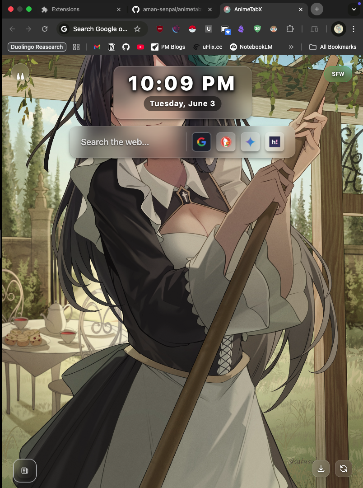
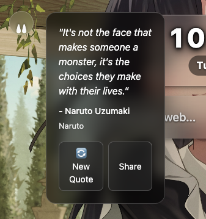
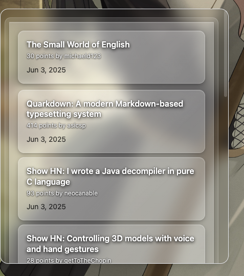

# AnimeTabX

A beautiful Chrome extension that transforms your new tab page into an anime-themed experience, featuring stunning wallpapers, inspiring anime quotes, and the latest anime news.








## Features

- 🎨 Beautiful anime wallpapers for your new tab page
- 💭 Inspiring anime quotes with character and anime source
- 📰 Latest anime news and updates from multiple sources
- 🖼️ High-quality image display
- 🔄 Automatic wallpaper rotation
- 💾 Local storage for preferences
- 🎯 Clean and modern user interface
- 🔍 Multiple search engine options (Google, DuckDuckGo, Gemini, Anime)
- 🌓 Dark mode optimized design

## Installation

### From Chrome Web Store
1. Visit the Chrome Web Store (link to be added)
2. Click "Add to Chrome"
3. Confirm the installation

### Manual Installation (Development)
1. Clone this repository:
   ```bash
   git clone https://github.com/aman-senpai/animetabx.git
   ```
2. Navigate to the project directory:
   ```bash
   cd animetabx
   ```
3. Install dependencies:
   ```bash
   npm install
   ```
4. Build the extension:
   ```bash
   npm run build
   ```
5. Open Chrome and go to `chrome://extensions/`
6. Enable "Developer mode"
7. Click "Load unpacked" and select the `dist` directory

## Features in Detail

### Anime Quotes
- Daily inspirational quotes from popular anime series
- Displays character name and anime source
- Share functionality for your favorite quotes
- Easy refresh to get new quotes

### News Section
- Latest updates from Anime News Network
- Hacker News integration
- Collapsible news panel
- Clean and readable news format
- Direct links to full articles

### Search Bar
- Multiple search engine options:
  - Google
  - DuckDuckGo
  - Gemini
  - Anime-specific search
- Quick engine switching
- Clean and minimal design

## Development

### Prerequisites
- Node.js (v14 or higher)
- npm (v6 or higher)

### Available Scripts
- `npm run dev` - Start development server
- `npm run build` - Build the extension
- `npm run preview` - Preview the built extension
- `npm run generate-icons` - Generate extension icons

## API Usage
This extension uses the following APIs:
- Jikan API (MyAnimeList)
- Anime News Network
- Waifu.im
- Nekos API
- Hacker News API

## Contributing

Contributions are welcome! Please feel free to submit a Pull Request.

1. Fork the repository
2. Create your feature branch (`git checkout -b feature/AmazingFeature`)
3. Commit your changes (`git commit -m 'Add some AmazingFeature'`)
4. Push to the branch (`git push origin feature/AmazingFeature`)
5. Open a Pull Request

## Acknowledgments

- Thanks to all the API providers for their services
- Special thanks to the open-source community

## Contact

Aman Senpai - [@AmanSenpai](https://x.com/AmanSenpai)

Project Link: [https://github.com/aman-senpai/animetabx](https://github.com/aman-senpai/animetabx) 