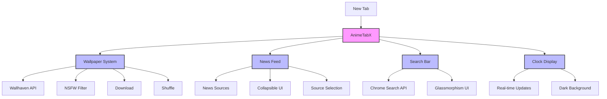

# AnimeTabX

<div align="center">
  
  <br>
  <p><em>Transform your new tab into an anime paradise</em></p>

  [](https://chrome.google.com/webstore/detail/animetabx/bfbpilalpdkbflfhbknmoiamnmafhmib)
  [](LICENSE)
  [](CONTRIBUTING.md)
</div>

A beautiful and modern Chrome extension that transforms your new tab page into an anime-themed experience. Features high-quality anime wallpapers, real-time news, and a sleek glassmorphism design.

## ✨ Features

<div align="center">
  <table>
    <tr>
      <td align="center">
        
        <br>
        <b>Dynamic Wallpapers</b>
        <br>
        <sub>High-quality anime backgrounds</sub>
      </td>
      <td align="center">
        
        <br>
        <b>Anime Quotes</b>
        <br>
        <sub>Awesome anime Quotes</sub>
      </td>
      <td align="center">
        
        <br>
        <b>News Feed</b>
        <br>
        <sub>Latest anime updates</sub>
      </td>
    </tr>
  </table>
</div>

- 🖼️ **Dynamic Anime Wallpapers**: Automatically updates with high-quality anime wallpapers
- 📰 **Anime News Feed**: Stay updated with the latest anime news from multiple sources
- 🎨 **Modern Glassmorphism UI**: Beautiful, modern interface with glass-like effects
- ⚡ **Fast & Lightweight**: Optimized performance with minimal resource usage
- 🌙 **Dark Theme**: Perfect for night browsing with eye-friendly dark mode
- 🔍 **Integrated Search**: Quick access to web search with enhanced visibility
- ⏰ **Elegant Clock**: Stylish time and date display
- 🎯 **NSFW Filter**: Toggle NSFW content with a simple switch
- 📱 **Responsive Design**: Works perfectly on all screen sizes

## 🏗️ Architecture



## 🚀 Quick Start

### From Chrome Web Store
1. Visit the [Chrome Web Store](https://chrome.google.com/webstore/detail/animetabx/bfbpilalpdkbflfhbknmoiamnmafhmib)
2. Click "Add to Chrome"
3. Confirm the installation

### Manual Installation
1. Download the latest release from the [Releases page](https://github.com/aman-senpai/animetabx/releases)
2. Extract the ZIP file
3. Open Chrome and go to `chrome://extensions/`
4. Enable "Developer mode" in the top right
5. Click "Load unpacked" and select the extracted folder

## 💡 Usage

1. Open a new tab in Chrome
2. The extension will automatically load with a beautiful anime wallpaper
3. Use the search bar to search the web
4. Toggle NSFW content using the switch in the top right
5. Click the news section to expand/collapse the news feed
6. Use the download button to save wallpapers
7. Click the shuffle button to change wallpapers

## 🔧 Development

### Prerequisites
- Node.js (v14 or higher)
- npm (v6 or higher)

### Setup
1. Clone the repository:
   ```bash
   git clone https://github.com/aman-senpai/animetabx.git
   cd animetabx
   ```

2. Install dependencies:
   ```bash
   npm install
   ```

3. Start development server:
   ```bash
   npm run dev
   ```

4. Build for production:
   ```bash
   npm run build
   ```

### Project Structure
```
animetabx/
├── src/
│   ├── css/
│   │   └── styles.css      # Main styles with glassmorphism
│   ├── js/
│   │   ├── components/     # React components
│   │   │   └── App.js
│   │   └── app.js         # Main application logic
│   └── assets/            # Images and icons
├── icons/                 # Extension icons
├── manifest.json          # Extension manifest
├── index.html            # Main HTML file
├── background.js         # Background service worker
├── vite.config.js        # Vite configuration
└── package.json          # Project dependencies
```

## 🤝 Contributing

We love your input! We want to make contributing to AnimeTabX as easy and transparent as possible, whether it's:

- Reporting a bug
- Discussing the current state of the code
- Submitting a fix
- Proposing new features
- Becoming a maintainer

1. Fork the repository
2. Create your feature branch (`git checkout -b feature/AmazingFeature`)
3. Commit your changes (`git commit -m 'Add some AmazingFeature'`)
4. Push to the branch (`git push origin feature/AmazingFeature`)
5. Open a Pull Request

## 📝 License

This project is licensed under the MIT License - see the [LICENSE](LICENSE) file for details.

## 🙏 Acknowledgments

- Anime wallpapers provided by [Wallhaven](https://wallhaven.cc/)
- News data from various anime news sources
- Icons from [Heroicons](https://heroicons.com/)
- Glassmorphism design inspiration from [Glassmorphism.io](https://glassmorphism.io/)

## 💖 Support

If you enjoy using AnimeTabX, please consider:
- ⭐ Starring the repository
- 🐛 Reporting bugs
- 💡 Suggesting new features
- 🤝 Contributing to the project

## 📋 Changelog

### v1.1.0
- Enhanced glassmorphism effects
- Improved text visibility
- Added dark backgrounds for better contrast
- Optimized search bar visibility
- Refined UI animations
- Updated responsive design

### v1.0.0
- Initial release
- Basic wallpaper functionality
- News feed integration
- Search implementation
- Clock display
- NSFW toggle 